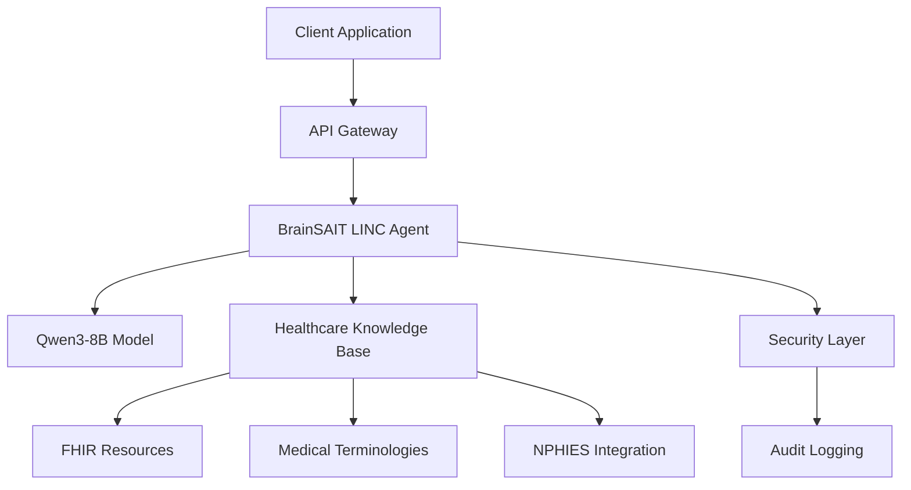

# Volume 3: Tech & Development

<div style="text-align: center; margin: 2em 0;">
  <h2>⚙️ Technical Architecture & Development Guide</h2>
</div>

---

## Overview

This volume provides comprehensive technical documentation for developers, system architects, and IT professionals implementing the BrainSAIT LINC Agent Ecosystem. It covers architecture, APIs, integration patterns, and development best practices.

---

## 📚 Topics Covered

### System Architecture
- **Model Architecture**: Qwen3-8B enhancements and optimizations
- **Agent Framework**: LINC agent structure and capabilities
- **Infrastructure**: Cloud and on-premises deployment
- **Security Architecture**: Multi-layer security approach
- **Scalability**: Horizontal and vertical scaling strategies

### API Reference
- **REST API**: HTTP endpoints and methods
- **WebSocket API**: Real-time communication
- **FHIR API**: Healthcare interoperability
- **NPHIES API**: Saudi insurance integration
- **Authentication**: OAuth 2.0, API keys, JWT

### Integration Patterns
- **EHR Integration**: HL7 v2, CDA, FHIR
- **Microservices**: Service-oriented architecture
- **Event-Driven**: Async messaging and events
- **Batch Processing**: Bulk operations
- **Real-Time Processing**: Stream processing

### Development Tools
- **SDK**: Python, JavaScript, Go, Java
- **CLI Tools**: Command-line interfaces
- **Testing Framework**: Unit, integration, E2E tests
- **Debugging**: Logging, tracing, profiling
- **Monitoring**: Metrics, alerts, dashboards

---

## 🚀 Quick Start

### Installation

```bash
# Install LM Studio CLI
curl -sSL https://lmstudio.ai/install.sh | bash

# Clone the model
lms clone fadil369/brainsait-qwen3-8b

# Clone the preset
lms clone fadil369/advanced-professional-background-instructions-for-brain-sait-linc-agents
```

### Basic Usage

```python
from lmstudio import LMStudio

# Initialize client
client = LMStudio()

# Load model with preset
model = client.load_model(
    "fadil369/brainsait-qwen3-8b",
    preset="fadil369/advanced-professional-background-instructions-for-brain-sait-linc-agents"
)

# Generate response
response = model.chat([
    {"role": "user", "content": "Create a FHIR Patient resource"}
])

print(response)
```

---

## 🏗️ Architecture Overview

### High-Level Architecture



### Component Architecture

| Component | Technology | Purpose |
|-----------|-----------|---------|
| **Model Layer** | Qwen3-8B (GGUF/MLX) | Core AI inference |
| **Agent Layer** | LINC System Prompt | Domain expertise |
| **API Layer** | REST/WebSocket | Client interface |
| **Security Layer** | OAuth 2.0, TLS 1.3 | Authentication & encryption |
| **Data Layer** | FHIR R4, HL7 | Healthcare standards |
| **Integration Layer** | NPHIES, EHR APIs | External systems |

---

## 💻 Code Examples

### Example 1: Generate FHIR Patient

```javascript
// Node.js example
const LMStudio = require('lmstudio-sdk');

const client = new LMStudio({
  baseURL: 'http://localhost:1234'
});

async function createPatient() {
  const response = await client.chat.completions.create({
    model: 'fadil369/brainsait-qwen3-8b',
    messages: [{
      role: 'user',
      content: 'Create FHIR R4 Patient for Ahmad Al-Rashid, male, DOB 1985-03-15'
    }]
  });
  
  return JSON.parse(response.choices[0].message.content);
}
```

### Example 2: Medical Coding

```python
# Python example
from lmstudio import LMStudio

client = LMStudio()
model = client.load_model("fadil369/brainsait-qwen3-8b")

def get_icd10_codes(diagnosis):
    response = model.chat([{
        "role": "user",
        "content": f"What are the ICD-10 codes for: {diagnosis}"
    }])
    return response
```

### Example 3: NPHIES Integration

```go
// Go example
package main

import (
    "github.com/lmstudio/lmstudio-go"
)

func verifyEligibility(memberID, payerID string) (string, error) {
    client := lmstudio.NewClient()
    
    response, err := client.Chat([]lmstudio.Message{
        {
            Role: "user",
            Content: fmt.Sprintf(
                "Generate NPHIES eligibility request for Member: %s, Payer: %s",
                memberID, payerID,
            ),
        },
    })
    
    return response.Content, err
}
```

### Example 4: Bilingual Translation

```java
// Java example
import ai.lmstudio.LMStudioClient;
import ai.lmstudio.Message;

public class BilingualTranslator {
    private LMStudioClient client;
    
    public BilingualTranslator() {
        this.client = new LMStudioClient();
    }
    
    public String translateToArabic(String englishText) {
        List<Message> messages = Arrays.asList(
            new Message("user", 
                "Translate to Arabic with medical terminology: " + englishText)
        );
        
        return client.chat(messages).getContent();
    }
}
```

---

## 🔌 Integration Examples

### EHR System Integration

```python
from brainsait_linc import Agent
from ehr_connector import EHRSystem

# Initialize components
agent = Agent(
    model="fadil369/brainsait-qwen3-8b",
    preset="fadil369/advanced-professional-background-instructions-for-brain-sait-linc-agents"
)
ehr = EHRSystem(endpoint="https://ehr.example.com/fhir")

# Fetch patient data
patient = ehr.get_patient("12345")

# Generate clinical summary
summary = agent.chat(f"Summarize patient encounters: {patient.encounters}")

# Store in EHR with audit trail
ehr.save_note(
    patient_id="12345",
    note=summary,
    audit_log=agent.get_audit_log()
)
```

### NPHIES Gateway Integration

```python
def process_nphies_claim(claim_data):
    # Generate FHIR claim bundle
    claim_bundle = agent.chat(f"""
    Create NPHIES claim submission bundle:
    Patient ID: {claim_data['patient_id']}
    Services: {claim_data['services']}
    Provider: {claim_data['provider']}
    """)
    
    # Submit to NPHIES gateway
    response = nphies_gateway.submit_claim(
        bundle=claim_bundle,
        credentials=get_nphies_credentials()
    )
    
    return response
```

---

## 🛠️ Development Best Practices

### Code Quality
- **Type Safety**: Use type hints (Python) or strong typing
- **Error Handling**: Comprehensive exception management
- **Testing**: Unit, integration, and E2E tests
- **Documentation**: Inline comments and API docs
- **Code Review**: Peer review before deployment

### Security
- **Input Validation**: Sanitize all user inputs
- **PHI Protection**: Encrypt sensitive data
- **Access Control**: Implement RBAC
- **Audit Logging**: Track all PHI access
- **Secure Coding**: Follow OWASP guidelines

### Performance
- **Caching**: Cache frequent queries
- **Batching**: Process multiple records efficiently
- **Streaming**: Use streaming for large responses
- **Connection Pooling**: Reuse connections
- **Monitoring**: Track performance metrics

---

## 🧪 Testing

### Test Structure

```python
import pytest
from brainsait_linc import Agent

class TestHealthcareAgent:
    @pytest.fixture
    def agent(self):
        return Agent(model="fadil369/brainsait-qwen3-8b")
    
    def test_fhir_patient_generation(self, agent):
        response = agent.chat([{
            "role": "user",
            "content": "Create FHIR Patient for test patient"
        }])
        
        assert "resourceType" in response
        assert response["resourceType"] == "Patient"
    
    def test_icd10_coding(self, agent):
        response = agent.chat([{
            "role": "user",
            "content": "ICD-10 code for type 2 diabetes"
        }])
        
        assert "E11" in response
```

---

## 📊 Performance Benchmarks

| Operation | Context Size | Avg Response Time | Accuracy |
|-----------|-------------|-------------------|----------|
| Simple query | <1K tokens | 0.5-1s | 99% |
| FHIR generation | 1-5K tokens | 2-4s | 98.5% |
| Clinical summary | 5-20K tokens | 5-10s | 97% |
| ICD-10 coding | <2K tokens | 1-2s | 95.2% |
| Arabic translation | <3K tokens | 2-3s | 94.6% |
| Chart review | 20-50K tokens | 15-30s | 96% |

---

## 📖 Related Documentation

- [Volume 1: Healthcare Documentation](../healthcare/index.md)
- [Volume 2: Business Documentation](../business/index.md)
- [Volume 4: Personal Development](../personal/index.md)
- [Branding Guidelines](../brand/index.md)

---

!!! tip "Coming Soon"
    This section is being actively developed. Check back soon for comprehensive API documentation, integration guides, and code examples.

---

*For healthcare-specific implementations, see [Volume 1: Healthcare Documentation](../healthcare/index.md)*
